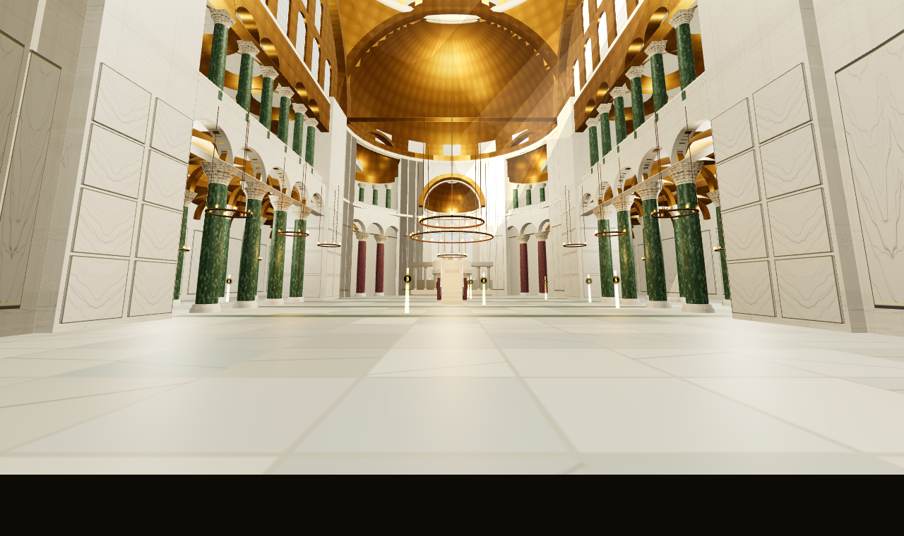
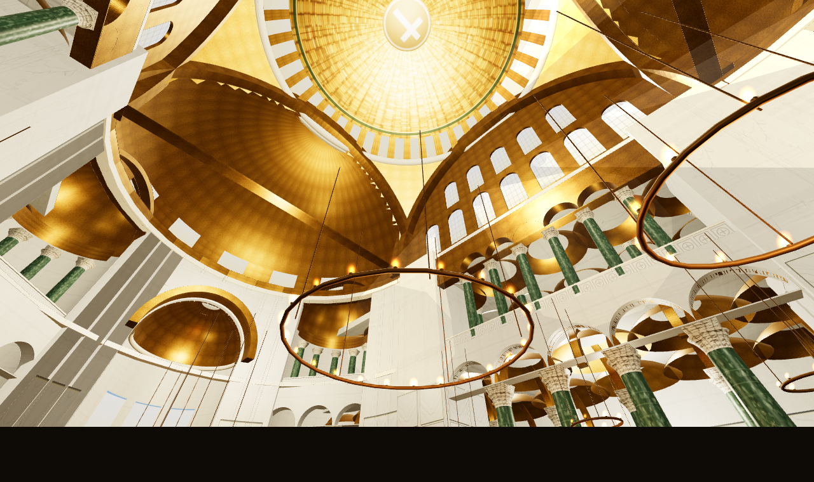
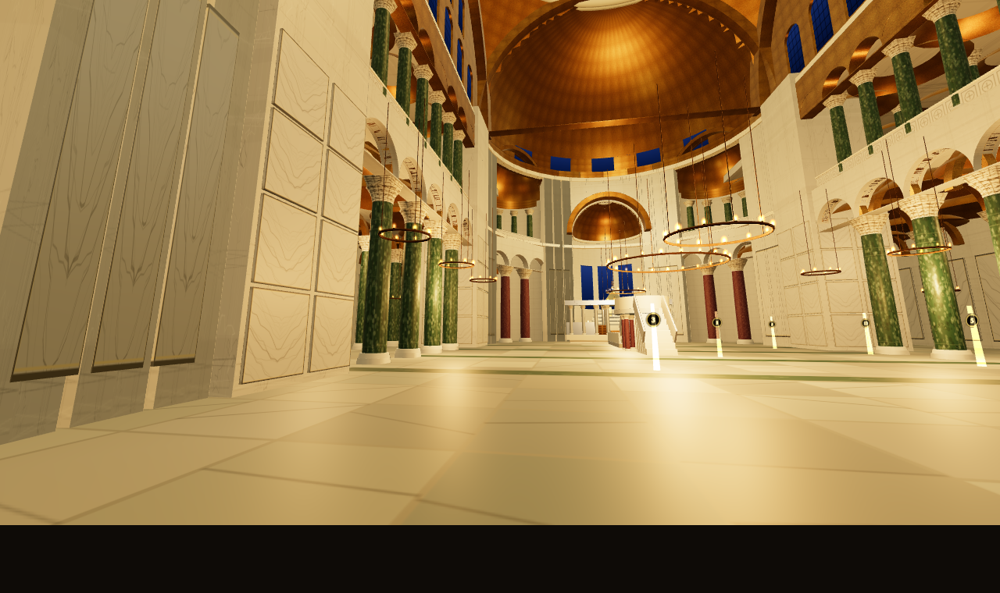
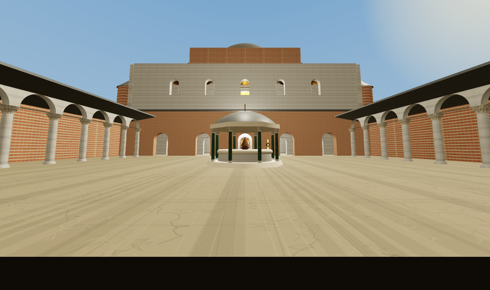

# Αγία Σοφία · 537 — Interactive Museum






A walkable, first-person 3D reconstruction of **Hagia Sophia as Justinian
consecrated it on 27 December 537** — the original shallow dome that fell in
558, the silver templon and great ambo, gold vaults before any figural
mosaics, the atrium with its phiale fountain. No minarets, no buttresses,
no later centuries.

Fourteen numbered museum stations (EN/ΕΛ) tell the story: walk up to a
golden marker and press **E**.

## Run it

The app is fully self-contained (Three.js is vendored, every texture is
generated procedurally at load — there are **no** external assets or network
calls).

- **Inside SymposiON**: it appears as **«Αγία Σοφία 537»** in the engines
  carousel (launched like any iframe game via `openHagiaSophia`).
- **Standalone**: open `index.html` directly in a browser, or serve the
  repo (`python3 -m http.server`) and visit
  `synthesis/games/hagia-sophia/`.

## Controls

| Input | Action |
| --- | --- |
| `W A S D` / arrows | walk (`Shift` = hurry) |
| Mouse (pointer-lock) | look |
| `E` | open / close the nearest exhibit |
| `Tab` | exhibit index (click an entry to travel there, incl. the gallery) |
| `N` | day ↔ dusk (Paul the Silentiary's "second sun") |
| `L` | hanging lamps on/off |
| `M` | mini-map on/off |
| Touch | left half = move stick, right half = look |

URL params: `?lang=gr|en`, `?start=nave`, `?mode=dusk`, and a headless
screenshot mode `?shot=x,y,z,yawDeg,pitchDeg[&hud=1][&panel=<id>]` used for
automated visual testing.

## What is evidence and what is conjecture

The building envelope follows the modern surveys (R. L. Van Nice; R. J.
Mainstone, *Hagia Sophia*, 1988): 31 m central square, gallery floor
≈ 13 m, great cornice ≈ 23 m, arch springing ≈ 24.3 m, crowns ≈ 40 m.
The **first dome** is restored ≈ 7 m shallower than today's (crown ≈ 49 m),
per the sources on the 558 collapse and 562 rebuild; its exact profile is
scholarly conjecture. The furnishings — raised bema, silver-faced templon
with monogram medallions, altar under a tower ciborium, solea, the great
ambo, seven-tier synthronon — follow **Paul the Silentiary's** ekphrasis
(563) and reconstructions derived from it (Xydis and others); their precise
forms are informed conjecture. The Justinianic decoration is deliberately
**aniconic**: gold, crosses and ornament only — the figural mosaics you may
know belong to the ninth century and later. Marble palette: Proconnesian
revetment and pavement with Thessalian verd antique bands, verd antique
shafts, Egyptian porphyry in the exedrae.

Primary voices quoted in the exhibits: **Procopius**, *De aedificiis* I.i
(the "golden chain", the light); **Paul the Silentiary**, *Descriptio*
(marbles as meadows, the night lighting that guided sailors); the
**"Νενίκηκά σε Σολομών"** tradition (Narratio de S. Sophia).

## Code layout

```
index.html        UI shell (intro, HUD, exhibit panel, index, mini-map)
vendor/three.min.js   Three.js r160 (UMD, vendored — works from file://)
js/util.js        dimensions (HS.DIM), geometry helpers, colliders/floors
js/materials.js   all procedural canvas textures + materials
js/parts.js       column factory (instanced), arcades, cornices, panes
js/nave.js        piers, colonnades, tympana, arches, pendentives,
                  the 537 dome, semidomes, exedrae
js/aisles.js      side aisles + galleries, outer walls, vault caps
js/east.js        bema, apse + synthronon, templon, altar + ciborium,
                  solea, ambo
js/west.js        west wall + 9 doors (Imperial Door), narthex + loge,
                  exonarthex, atrium + phiale, exterior massing
js/lighting.js    sun + god-rays, polykandela, day/dusk
js/controls.js    pointer-lock / touch FPS controls, collision, floors
js/exhibits.js    the 14 stations (EN/ΕΛ), markers, mini-map
js/audio.js       generative ambience (drone + synthesized reverb)
js/main.js        boot, loop, HUD wiring, screenshot mode
launcher.js       SymposiON shell glue (openHagiaSophia/closeHagiaSophia)
```

Everything is plain ES5-ish classic scripts — no build step, loads from
`file://`, GitHub Pages, or Firebase Hosting unchanged.

See `UNREAL-PORT.md` for a concrete guide to rebuilding this scene in
Unreal Engine 5.
